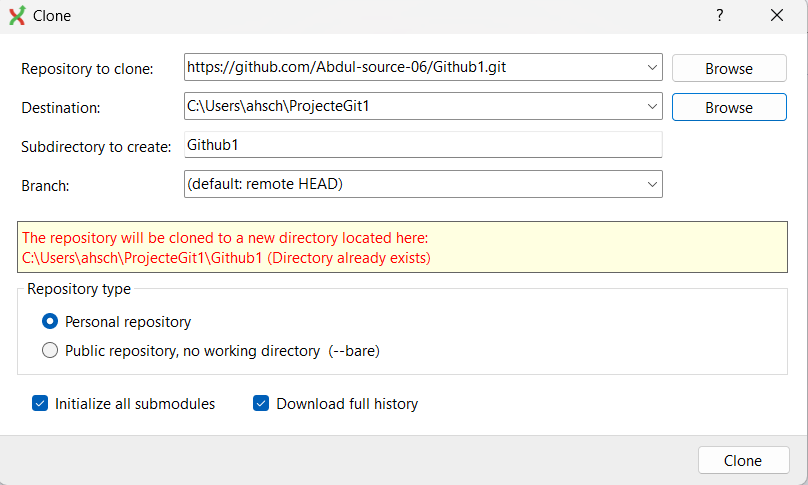
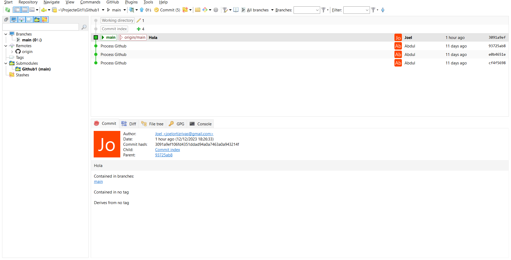
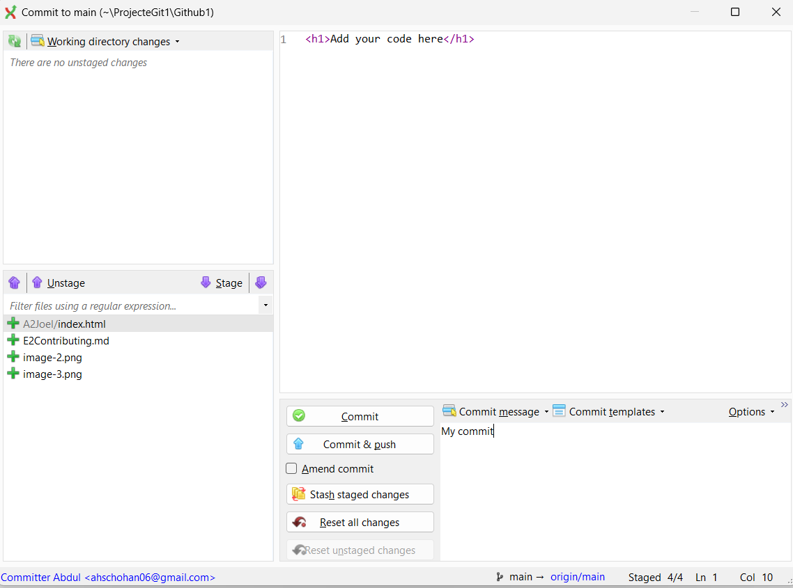

## 1. Configure the repository in GitHub so that another classmate is allowed to clone it and push changes to it.

* First of all, we give our colleague permission to clone the repository, and for that we have to go to Settings, then click on "Collaborators", and enter our colleague's username.

## 2. Clone the repository locally with Git Extensions.

* To do this step you have to download the git extensions, and then clone the repository, to clone the repository we paste the link of the repository and we save it in a new directory that we created and in the end in this case we put it private.

And in the following image you can see that we have cloned it correctly:

 The final step would be to do the "commit" and "push".

## Work History
